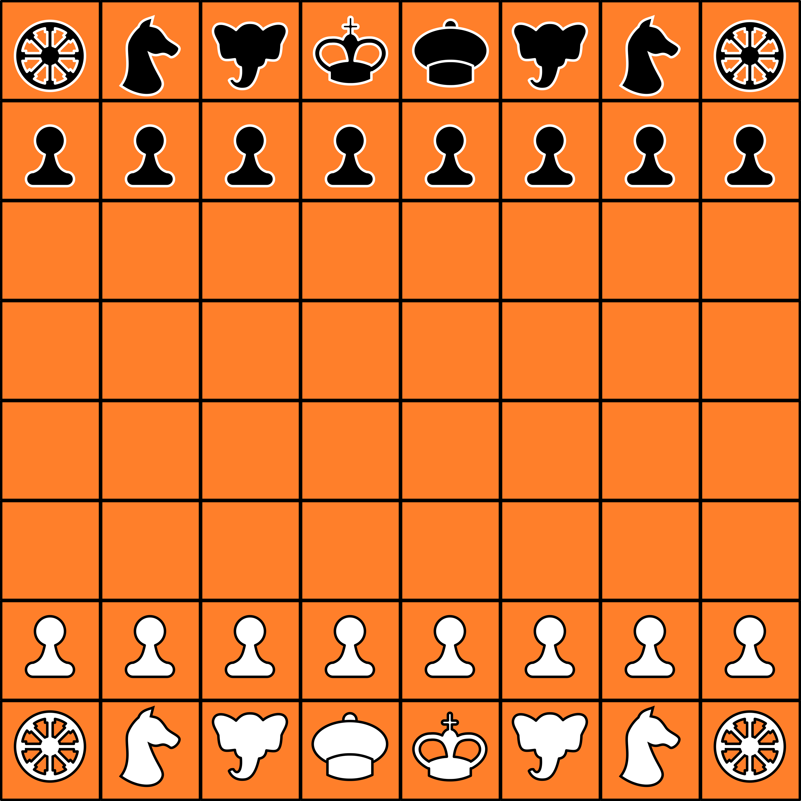
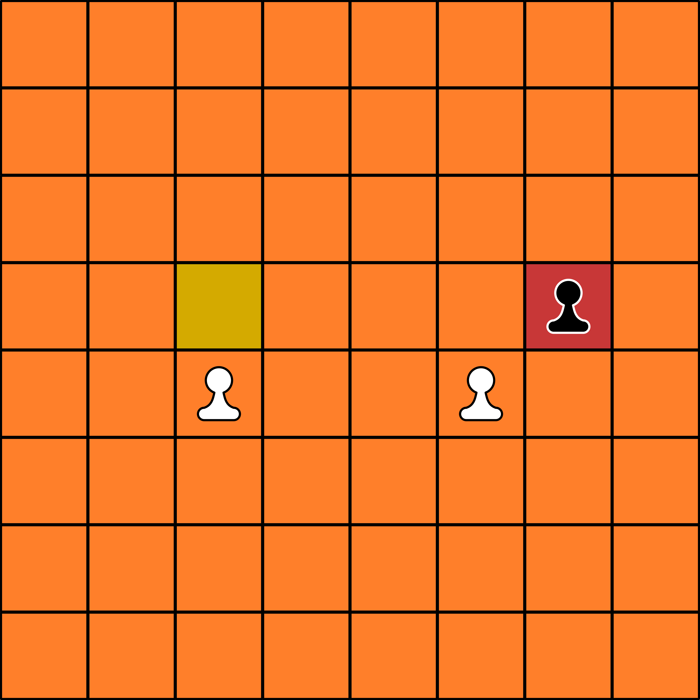
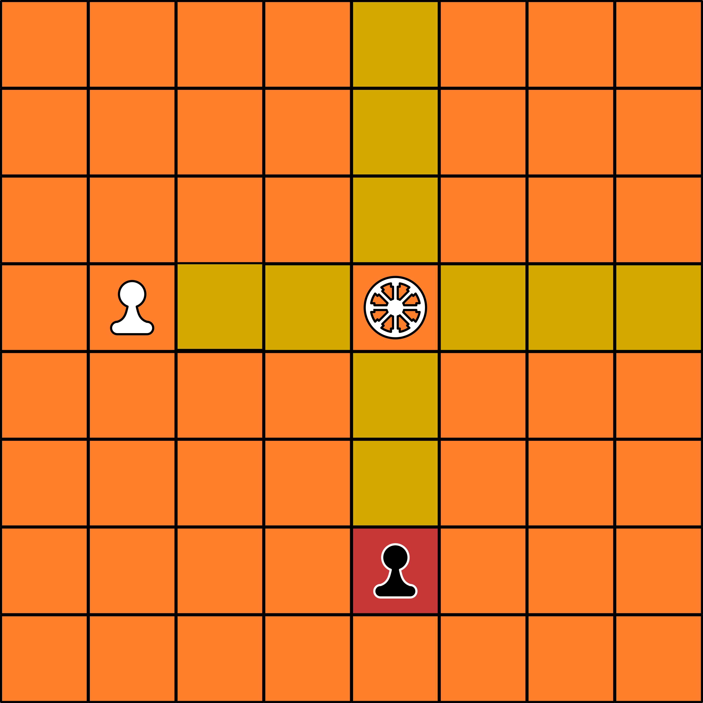
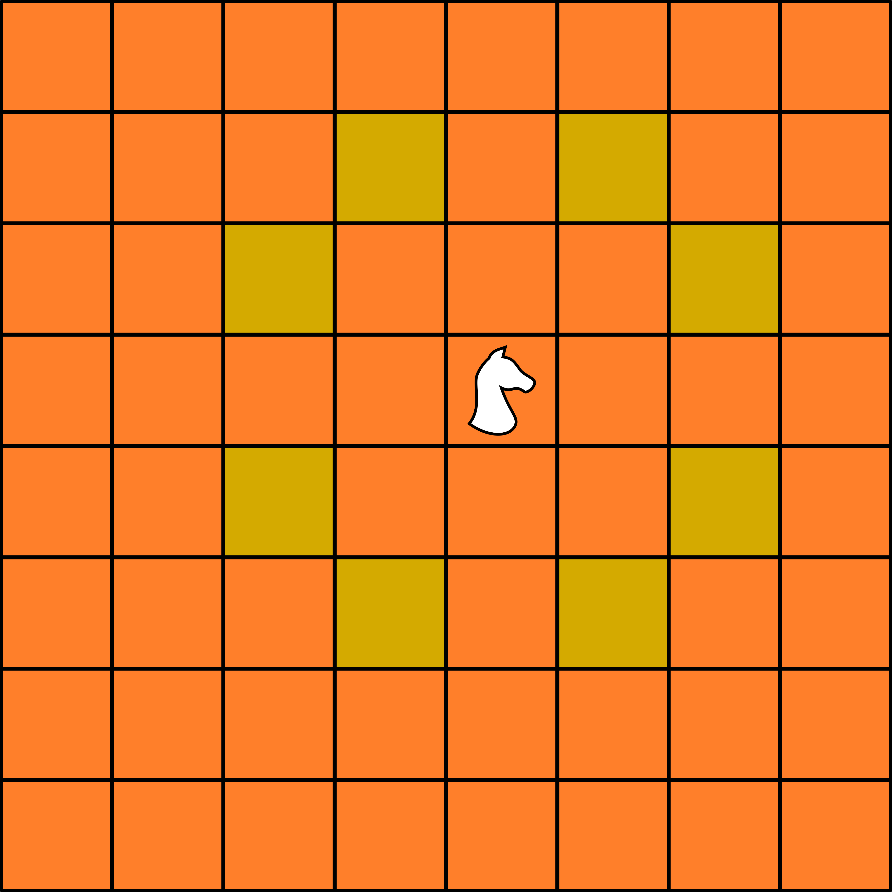
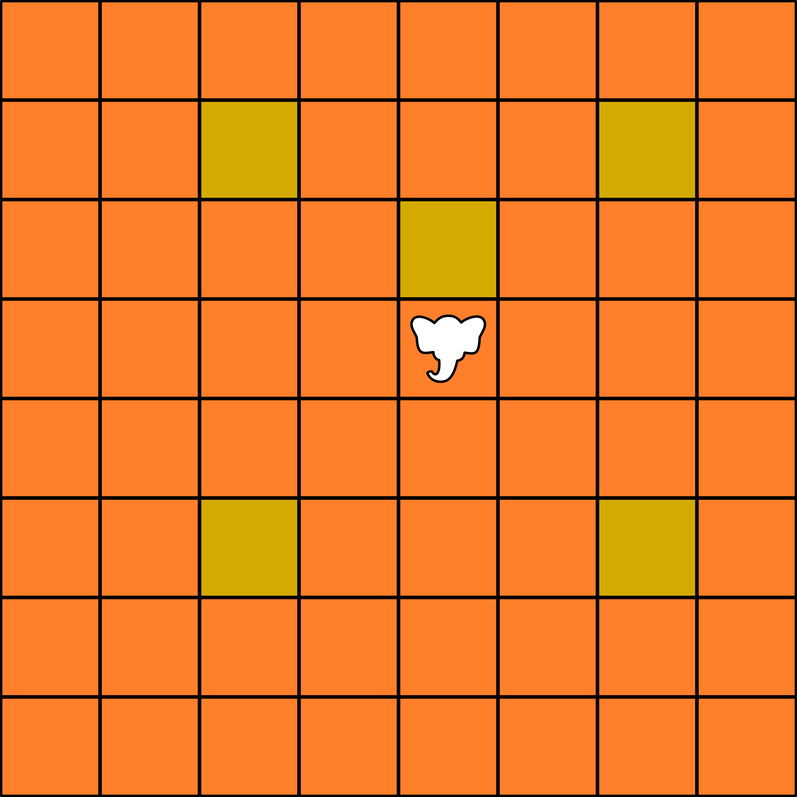
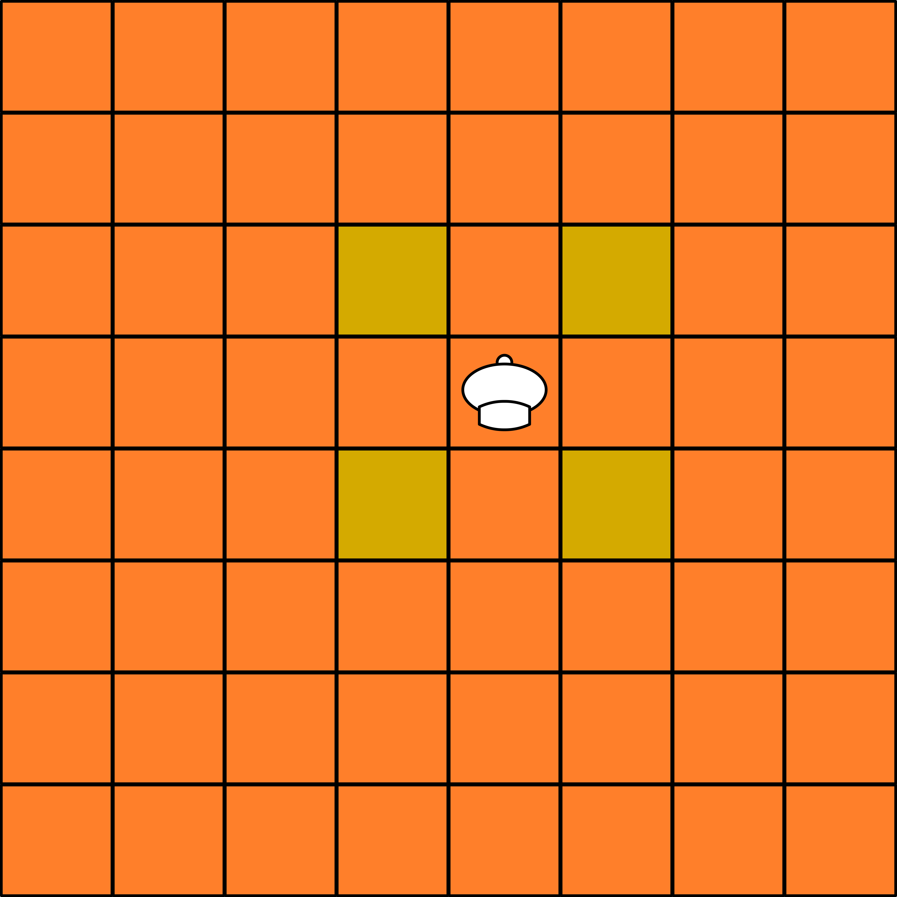
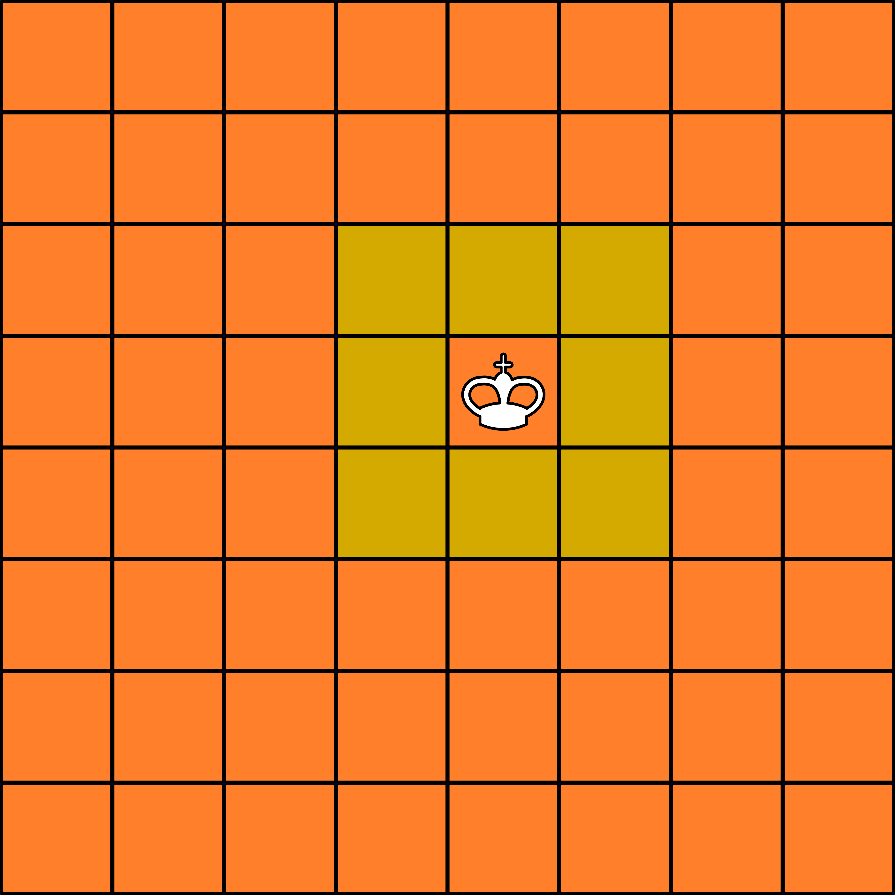

# Chaturanga
Chaturanga é um jogo composto por dois jogadores, um tabuleiro 8x8 e 16 peças para cada jogador. 

As 16 peças compõem um exército e se dividem em oito Padati, dois Ratha, dois Ashwa, dois Gaja, um Mitri e um Raja.

A distribuição do exército no tabuleiro para o início da partida se dá como na seguinte imagem: 

## Regras

O jogador com as peças brancas é o primeiro a jogar e, então, os turnos alternam entre os dois jogadores. O objetivo do jogo é capturar o Raja inimigo ou aniquilar o exército adversário.

A cada turno, o jogador escolhe uma peça que controla e a move para alguma casa vazia ou captura uma peça adversária. 

## Movimentação
As regras de movimento para cada peça são as seguintes:

- Padati (Soldado): anda uma casa diretamente para frente ou, no caso de existir uma peça inimiga na sua diagonal direta, captura uma peça inimiga em sua diagonal direta. 

- Ratha (Carruagem): anda em movimento ortogonal ao tabuleiro, ou seja, tanto para frente/trás quanto para esquerda/direita e se move quantas casas forem desejadas.

- Ashwa (Cavalo): anda imediatamente na diagonal oposta de um retângulo 3x2 e ignora qualquer peça que exista no caminho. 

- Gaja (Elefante): anda duas casas em uma diagonal adjacente e ignora qualquer peça que exista no caminho, ou uma casa diretamente para frente. 

- Mitri (Ministro): anda uma casa em uma diagonal adjacente. 

- Raja (Rei): anda uma casa em qualquer direção adjacente. 

Nota-se que no caso das peças que tem movimento de várias casas, elas param ao colidir com uma peça aliada ou ao capturar uma inimiga a não ser que seja especificado que ignoram outras peças. 
Em caso de movimento que resulta em captura, a peça que fez o movimento passa a ocupar a casa previamente pertencente a capturada.

No caso especificamente do Padati, há a possibilidade de promoção para virar um Mitri. Para isso, é necessário que a peça encoste na borda do tabuleiro pertencente ao exército do adversário.

## Referências
https://www.chessvariants.com/historic.dir/chaturanga.html

https://en.wikipedia.org/wiki/Chaturanga